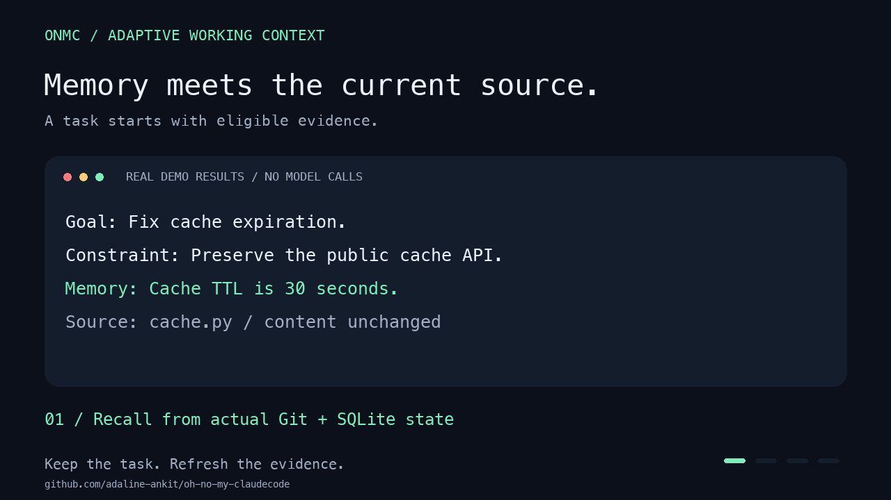

# Your code changed. Your agent's memory should too.

ONMC gives Claude Code **adaptive working context**: goals, constraints, decisions,
and next steps survive compaction; recalled claims are withdrawn when their source
files change. Local SQLite, inspectable decisions, no model calls to compile a packet.



*Rendering of actual Git, SQLite, and hook results. Eight checks, no model calls.
[Static image](assets/working-context-demo.png) · [Underlying results](assets/working-context-demo.json)*

## Start using it

Working context is available from `main`, ahead of the latest PyPI release (`v0.113.0`).

```bash
uv tool install --force 'git+https://github.com/adaline-ankit/oh-no-my-claudecode.git@main'
cd your-repo
onmc init
onmc ingest --no-llm
onmc working enable --constraint "Preserve public APIs"
claude
```

Start or resume Claude after enabling to load project hooks. Other agents can use
explicit sessions through CLI and MCP. Instructions remain advisory: source
freshness does not prove correctness or guarantee agent compliance.

[Get started with working context](working-context.md)
· [Browse source on GitHub](https://github.com/adaline-ankit/oh-no-my-claudecode)

## Evidence you can inspect

| Measurement | Result | Scope |
|---|---|---|
| Context eligibility and delivery | 117/117 checks | Internal synthetic event suite |
| Repeat suppression | 36.5% fewer characters | Compared with forced-refresh adaptive packets |
| Packet compilation at 10,000 memories | 2.48 ms median | In-process, one Apple M4 |
| Live Codex pilot | 3/3 vs 3/3 tasks | No demonstrated accuracy improvement |

[Protocol and limitations](benchmarks/working-context.md)
· [Results](benchmarks/results/2026-09-19-working-context/README.md)

## Build on the rest of ONMC

Repository memory, configured verifier gates, durable runs, tamper-evident receipts,
trace/replay, and Git-portable knowledge are available behind the same CLI.
`onmc run "your task"` previews a plan; execution requires `--execute`.

- [Execution harness](harness-run.md)
- [Shipped capabilities](shipped-capabilities.md)
- [Architecture](architecture.md) and [memory model](memory-model.md)
- [CLI reference](cli-reference.md) and [environment variables](environment-variables.md)
- [Claude Code](integrations/claude-code.md), [Codex](integrations/codex.md), and [agent workflows](agent-native-workflows.md)
- [Task lifecycle](task-lifecycle.md), [prompt compiler](prompt-compiler.md), and [observability](observability.md)
- [Local dashboard](ui-dashboard.md) and [Obsidian export](obsidian.md)
- [Roadmap](roadmap.md), [release process](RELEASING.md), and [launch material](launch/adaptive-working-context.md)

MIT licensed. [Released package](https://pypi.org/project/oh-no-my-claudecode/)
· [Historical two-agent memory demo](demo.md)
