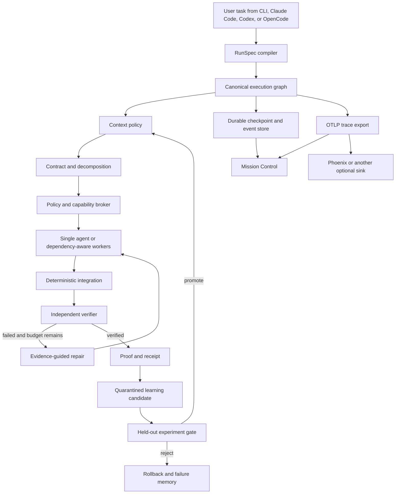
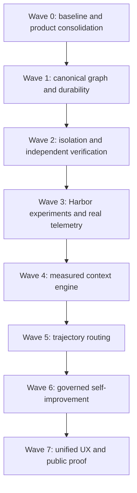

# ONMC SOTA Harness, Retrieval, and Evaluation Plan

## Goal Capsule

| Field | Contract |
|---|---|
| Objective | Turn ONMC from a broad command collection into one agent-neutral coding runtime that measurably improves completion reliability, verification quality, context efficiency, and cost over plain Claude Code, Codex, and OpenCode. |
| Product promise | One task enters; ONMC plans, runs, observes, verifies, repairs, and produces a reproducible proof receipt. |
| Primary user | An engineer or team using Claude Code, Codex, or OpenCode on repository-level work. |
| Authority | Measured held-out outcomes override architectural taste, framework popularity, and marketing goals. |
| Execution profile | Local-first runtime, optional cloud sandboxes, optional observability sinks, explicit paid-eval budgets. |
| Stop condition | ONMC may claim a capability only after its acceptance gate is met on external tasks under matched controls. |
| Tail ownership | ONMC owns orchestration, context, policy, verification, evidence, and learning gates. The selected coding agent owns code generation. |

---

## Product Contract

### Summary

ONMC should become an evidence-driven runtime above coding agents, not another coding agent and not a collection of independent prompt wrappers.
The product surface should collapse around one default workflow, `onmc run`, with `mission`, interactive Claude Code hooks, Mission Control, and specialized workflows acting as views or presets over the same execution graph.
Its defensible value is not "more autonomy"; it is autonomy that survives interruption, uses measured context, controls cost, rejects false completion, and improves only when held-out evidence supports the change.

### Problem Frame

The current repository has many valuable primitives: a verifier-backed loop, durable event storage, provider adapters, retrieval evaluation, experiment contracts, false-green challenges, receipts, and an interactive completion hook.
They are split across `mission`, `loop`, `harness_run`, `durable_runtime`, `retrieval`, `experiment`, `verifier`, `trace`, and more than one hundred command surfaces.
This fragmentation makes the system difficult to explain and permits shallow features to look equivalent to runtime-enforced features.

Current external evidence does not show an ONMC quality advantage.
The measured v1 experiment passed 9 of 9 trials in both arms while ONMC used 26.6% more reported mean cost and 31.6% more latency.
The v3 stage-one experiment passed 24 of 24 tasks in both arms, used one trial per cell, and reported no quality delta.
Those tests establish that the evaluation machinery can run, but their ceiling effect cannot support a SOTA claim.

### Requirements

**Product and runtime**

- R1. ONMC exposes one canonical execution contract whose nodes perform real work and whose state is durable, inspectable, and resumable.
- R2. `mission`, interactive wrapping, swarm execution, and specialized workflows must delegate to the canonical runtime instead of implementing parallel orchestration paths.
- R3. Every side-effecting node has an idempotency key, explicit budget, retry policy, timeout, typed input/output, and falsifiable completion condition.
- R4. The runtime supports deterministic single-agent execution, dependency-aware parallel fan-out, deterministic fan-in, approval interrupts, cancellation, and crash recovery.
- R5. A run cannot be marked complete from agent prose, process exit alone, or a vacuous verifier pass.

**Verification and safety**

- R6. Completion requires independent evidence that the requested behavior is reached, tests are meaningful, protected files were not weakened, and the final repository state satisfies policy.
- R7. Execution is isolated by default for autonomous or long-running work, with network, filesystem, secret, process, time, token, and cost capabilities declared before execution.
- R8. Receipts remain local, canonical, tamper-evident, replayable, and exportable without requiring a hosted platform.

**Context and retrieval**

- R9. Retrieval is a measured context policy, not an embedding feature: lexical, semantic, graph, history, memory, and reranking stages ship only when they improve held-out retrieval or downstream task outcomes.
- R10. Context selection reports provenance, explored and used context, token cost, retrieval confidence, and abstention or fallback decisions.
- R11. Repository learning enters production context only after held-out evaluation, protected-suite non-regression, provenance checks, and a reversible promotion decision.

**Evaluation and adaptation**

- R12. ONMC evaluates itself through containerized, pinned, agent-neutral trials with matched model, task, environment, tool, budget, and seed controls.
- R13. Reports include raw trajectories, verifier artifacts, pass rates, pass@k, paired deltas, uncertainty, latency, token use, cost coverage, failure taxonomy, and data-leakage audit.
- R14. Model routing uses observed partial trajectories and verified repository history; static prompt-only complexity labels may be a baseline but cannot be the production policy.
- R15. Harness self-improvement treats every candidate change as a prediction-backed experiment and may promote only after a pre-registered gate passes.

**User experience and portability**

- R16. A user gets useful ONMC behavior after one setup action and one task command, while advanced commands remain available as diagnostics and operator controls.
- R17. Claude Code, Codex, and OpenCode use the same task, evidence, budget, and receipt contracts; provider-specific limitations remain visible.
- R18. Mission Control renders only observed graph state, evidence, cost, context, and decisions from the canonical event stream.
- R19. The default and recommended installation paths contain no known unpatched critical dependency, and optional integrations with unresolved advisories are quarantined from normal installation and evaluation.

### Actors

- A1. Individual engineer running a task from Claude Code, Codex, OpenCode, or the terminal.
- A2. Repository maintainer defining policy, protected tests, budgets, and promotion gates.
- A3. Engineering lead comparing team outcomes and reviewing evidence.
- A4. ONMC runtime executing and observing the graph.
- A5. Coding-agent adapter generating or reviewing code.
- A6. Independent verifier adjudicating completion.

### Key Flows

- F1. Verified autonomous task
  - **Trigger:** A1 asks for a repository-level change.
  - **Actors:** A1, A4, A5, A6.
  - **Steps:** Intake compiles a task contract; context is selected; the runtime executes; independent verification checks the final state; repair edges run when needed; a receipt records evidence.
  - **Outcome:** The user receives a verified result or a bounded, evidence-backed failure.
  - **Covered by:** R1-R10, R16-R18.
- F2. Long-running resumable mission
  - **Trigger:** A1 starts work expected to exceed one interactive session.
  - **Actors:** A1, A2, A4, A5, A6.
  - **Steps:** The graph checkpoints after every node; side effects are idempotent; approval interrupts persist; restart or handoff resumes the same run.
  - **Outcome:** Work survives crashes, restarts, compaction, and provider changes without duplicating irreversible actions.
  - **Covered by:** R1-R8, R17.
- F3. Context policy improvement
  - **Trigger:** A retrieval or memory candidate is proposed.
  - **Actors:** A2, A4, A6.
  - **Steps:** Candidate and baseline run on frozen retrieval and end-to-end datasets; downstream quality and context efficiency are compared; promotion requires a passing gate.
  - **Outcome:** Production retrieval changes only when evidence shows net value.
  - **Covered by:** R9-R13, R15.
- F4. Adaptive model escalation
  - **Trigger:** A cheap model begins a task.
  - **Actors:** A4, A5, A6.
  - **Steps:** ONMC observes early tool, code, test, uncertainty, and progress signals; a router decides to continue, escalate, or stop; verified outcomes update only the quarantined routing dataset.
  - **Outcome:** Cost falls without violating the declared quality bound.
  - **Covered by:** R12-R15, R17.

### Acceptance Examples

- AE1. A process crashes after an external tool call. Restarting the run reuses the recorded result and does not repeat the side effect.
- AE2. An agent edits code but weakens a test. The normal test command exits zero, yet ONMC rejects completion because protected-test and mutation evidence fail.
- AE3. Dense retrieval returns plausible but irrelevant code. ONMC either falls back to BM25 or omits dense results because the query-level confidence gate is not met.
- AE4. A Haiku-class model starts a task, discovers a cross-module dependency and repeated failing tests, and ONMC escalates the next bounded episode without discarding verified progress.
- AE5. A new memory improves training tasks but hurts a held-out protected suite. The candidate remains quarantined and is absent from production context.
- AE6. Claude Code and Codex run the same Harbor task with the same model family, limits, environment, and verifier contract; adapter limitations are recorded rather than silently imputed.

### Measurable Quality Rubric

No plan can guarantee a 9/10 score.
ONMC earns each score only after the listed gate is independently reproducible.
The current score is a code-and-evidence assessment of the active branch, not a public product claim.

| Dimension | Current assessment | 9/10 promotion gate | 10/10 evidence |
|---|---:|---|---|
| Product coherence | 4/10 | One default runtime; primary help contains fewer than 15 outcome/operator commands; all workflow aliases delegate to it. | External users complete setup and a verified task without consulting command reference; no duplicate runtime semantics. |
| Runtime durability | 6/10 | Crash-resume tests at every node; zero duplicate side effects in 1,000 fault-injection runs; 24-hour soak with persisted interrupts and cancellation. | Multi-host recovery and migration with independently audited state invariants. |
| Verification | 7/10 | At least 95% sensitivity and 98% specificity on an external false-green corpus; protected-test tampering and vacuous passes always blocked. | Independent reproduction on hidden tasks across languages and verifier types. |
| Evaluation rigor | 5/10 | At least 50 discriminative external tasks, 3 seeds, 3 agent/model configurations, paired confidence intervals, complete trace and environment manifests. | Multiple public suites with hidden or time-sliced tasks and third-party reruns. |
| Retrieval and context | 5/10 | On held-out code-context datasets: Recall@5 at least 0.90, nDCG@10 at least 0.85, context precision improves, and downstream pass rate or cost improves significantly. | Generalizes across languages, repo sizes, task classes, and unseen repositories under fixed context budgets. |
| Cost efficiency and routing | 2/10 | Quality is non-inferior within 2 percentage points while cost falls at least 20%, or quality rises significantly inside a predeclared cost ceiling; router regret beats static baselines. | Stable gains across providers and model generations without manual retuning. |
| Observability | 4/10 | Every node, model call, tool call, retrieval, verifier, policy, and routing decision emits real timestamps and measured usage through OTLP; no synthetic token split. | End-to-end lineage from user task to receipt with privacy controls and cross-system trace correlation. |
| Self-improvement | 3/10 | Every candidate has prediction, component diff, dataset revision, matched results, provenance, rollback, and no direct path to production. | Repeated autonomous iterations produce statistically reliable cross-family gains without benchmark overfit. |
| Isolation and security | 6/10 | Autonomous execution uses a true container or microVM boundary; secrets are capability-scoped; egress defaults deny; adversarial suite passes. | Independent security review plus enterprise policy, audit, and supply-chain controls. |
| Agent portability | 6/10 | Claude, Codex, and OpenCode pass the same adapter conformance suite with at least 95% contract coverage and honest cost-capability labels. | Comparable measured gains across all supported agents without provider-specific product forks. |
| User experience | 4/10 | Five-minute setup; one task entry point; live graph and evidence UI; bounded human questions; recovery instructions generated from state. | Measured activation, completion, and trust metrics from external users show the runtime is easier than the underlying agent alone. |

### Scope Boundaries

**In scope**

- One agent-neutral coding runtime above existing coding-agent CLIs and SDKs.
- Local-first state, receipts, policy, context, experiments, and UI.
- Optional LangGraph execution backend, Harbor evaluation, cloud sandboxes, and OTLP sinks.
- Measured context retrieval, trajectory routing, and eval-gated learning.

**Deferred until the 9/10 gates pass**

- Hosted multi-tenant ONMC control plane.
- Reinforcement learning or model fine-tuning from ONMC trajectories.
- Enterprise SSO, billing, and organization administration.
- Hundreds-agent production fleets.

**Outside the product identity**

- A new foundation model.
- A replacement IDE or replacement for Claude Code, Codex, or OpenCode.
- A marketplace of unrelated novelty commands.
- Autonomous merging or deployment without repository policy and independent proof.
- "SOTA" claims based only on internal fixtures, one trial, synthetic labels, or benchmark wins without cost and leakage accounting.

---

## Planning Contract

### Key Technical Decisions

- KTD1. **One runtime, many views.** `HarnessController` remains the compatibility boundary while a typed graph kernel is introduced behind an `ExecutionBackend` protocol. `mission`, wrapping, swarm, and workflow commands compile to the same `RunSpec`.
- KTD2. **Adopt LangGraph as an optional execution backend, not as ONMC's product identity.** LangGraph provides checkpoints, conditional edges, subgraphs, interrupts, and replay, but replay can re-execute nodes after a checkpoint. ONMC must keep its own idempotency and receipt contracts. Source: [LangGraph time travel](https://docs.langchain.com/oss/python/langgraph/use-time-travel), [LangGraph interrupts](https://docs.langchain.com/oss/python/langgraph/interrupts).
- KTD3. **Use Harbor instead of building a benchmark sandbox fleet.** Harbor already supports Claude Code, Codex, OpenCode, Docker, Daytona, E2B, Modal, standard datasets, parallel trials, and agent trajectory exchange. ONMC contributes an adapter, task suites, and result normalization. Source: [Harbor](https://github.com/harbor-framework/harbor).
- KTD4. **Keep ONMC's experiment manifest and receipt canonical.** LangSmith, Braintrust, or Phoenix may mirror traces and experiments, but no hosted schema becomes required for execution or proof.
- KTD5. **Use OpenTelemetry for export and Phoenix as the default optional UI sink.** Current `trace/otel.py` produces synthetic one-millisecond spans and estimates a 60/40 token split; replace this with real nested spans and measured provider usage. Source: [OpenTelemetry GenAI observability](https://opentelemetry.io/blog/2026/genai-observability/), [Phoenix](https://github.com/Arize-ai/phoenix).
- KTD6. **Retrieval has a lexical floor.** BM25 remains the production baseline until dense, hybrid, graph, or reranking candidates beat it on both retrieval metrics and downstream outcomes. ContextBench shows that sophisticated scaffolding can yield marginal retrieval gains and that agents often over-retrieve. Source: [ContextBench](https://arxiv.org/abs/2602.05892), [CodeScaleBench](https://github.com/sourcegraph/CodeScaleBench).
- KTD7. **Route after observation, not from prompt keywords alone.** The router starts with a cheaper model for a bounded exploratory episode and escalates from partial trajectory, verifier, and repository signals. Source: [SWE-Router](https://arxiv.org/abs/2607.00053), [Agent-as-a-Router](https://arxiv.org/abs/2606.22902).
- KTD8. **Self-improvement is a governed experiment loop.** Every harness edit names the component, predicts a measurable effect, runs matched trials, and remains reversible. The implementation follows the component, experience, and decision observability pattern from Agentic Harness Engineering. Source: [Agentic Harness Engineering](https://arxiv.org/abs/2604.25850).
- KTD9. **Independent verification outranks agent confidence.** Mutation testing, reachability, protected-suite integrity, task-contract checks, and an independently executed verifier determine completion.
- KTD10. **True isolation is separate from git isolation.** Worktrees isolate changes; they do not isolate processes, networks, secrets, or the host filesystem. Autonomous execution uses Harbor-managed Docker locally and Daytona or Modal for scalable external trials.
- KTD11. **Paid systems are accelerators, not foundations.** Begin with OSS and free tiers. Purchase hosted services only after a capacity, collaboration, retention, or compliance need is measured.
- KTD12. **Delete product noise.** Social, gamified, and prompt-only commands leave primary help. Diagnostics remain callable through graph nodes, MCP tools, or an advanced namespace.
- KTD13. **Memory products are candidates, not architecture.** Mem0, Supermemory, Graphiti, and future hosted context services may implement an adapter arm, but ONMC adopts one only when the same frozen memory and downstream coding evaluations beat the local baseline. Mem0's current system combines semantic, BM25, entity, and temporal signals, making it a useful comparison rather than an automatic dependency. Source: [Mem0](https://github.com/mem0ai/mem0).

### High-Level Technical Design

### Runtime State Contract

The graph state contains:

- immutable run identity, task contract, environment digest, repository snapshot, model and adapter versions;
- current node, node attempts, dependency outputs, idempotency keys, leases, interrupts, approvals, and cancellation;
- context candidates, selected context, provenance, token budget, and retrieval decisions;
- tool calls, model calls, measured usage, policy decisions, and errors;
- change set, verifier plan, verifier outputs, proof graph, mutation and reachability findings;
- candidate learning IDs, evaluation manifest IDs, promotion decision, and rollback pointer;
- receipt hash chain and exported trace IDs.

No node may infer completion from another node's prose.
No replay may repeat an external side effect without first checking its idempotency record.

### Build-Versus-Buy Matrix

| Layer | Decision | Why | Initial cost posture |
|---|---|---|---|
| Execution graph | Build ONMC contracts; use LangGraph OSS as optional backend | ONMC needs provider-neutral state and receipts; LangGraph supplies proven graph mechanics. | $0 software. |
| Evaluation harness | Integrate Harbor OSS | Avoid rebuilding agents, datasets, containers, parallel jobs, and result layout. | $0 locally; compute and model usage only. |
| Local sandbox | Harbor with Docker | Reproducible default with no hosted dependency. | Existing local compute. |
| Cloud sandbox | Daytona first; Modal for burst runs; E2B only when long session/concurrency features justify its plan | Harbor supports all; Daytona currently includes $200 compute, Modal includes monthly starter credits, and E2B has useful long-session tiers. | Start with credits and a hard run budget. |
| Observability UI | Phoenix OSS self-hosted | OTLP-based, agent-neutral, local/private, includes tracing and eval workflows. | $0 plus local compute. |
| Hosted observability | Arize AX Free or LangSmith Developer during pilot | Fast collaboration without making either canonical. | $0 initially. |
| Experiment management | Keep ONMC manifests; optionally mirror to LangSmith or Braintrust | Prevent vendor lock-in; use hosted review only if it saves team time. | Do not buy Pro initially. |
| Retrieval framework | Build the measured policy on current ONMC interfaces; borrow LlamaIndex patterns only | A framework swap does not fix relevance; ONMC must own task-specific evaluation and budgets. | Embedding/reranker API usage only. |
| Vector storage | SQLite/vector extension or Qdrant only when corpus scale proves need | Repo-local corpora do not justify mandatory infrastructure. | $0 initially. |
| Model gateway | Extend existing adapters or LiteLLM boundary only when cost telemetry is reliable | Preserve direct CLI session support and avoid a new mandatory proxy. | Provider usage only. |

### Subscription and Evaluation Budget

Prices are point-in-time planning inputs and must be rechecked before purchase.

| Stage | Recommended services | Platform budget | Model and eval budget | Approval gate |
|---|---|---:|---:|---|
| Local engineering | LangGraph OSS, Harbor, Docker, Phoenix OSS | $0/month | Existing subscriptions or API keys | No paid benchmark. |
| Pilot external eval | Daytona credits or Modal Starter; LangSmith Developer or AX Free | $0-$50/month | $100-$300 total | Present manifest, task count, models, seeds, expected max cost, and abort ceiling before running. |
| Publication candidate | Daytona or Modal burst compute; optional AX Pro at $50/month | $0-$100/month | $500-$5,000 total depending on the powered model matrix | Explicit user approval after free smoke, one-seed calibration, and sample-size analysis. |
| Team product trial | Choose one hosted observability platform only after collaboration need is measured | $50-$249/month likely | Usage-dependent | Compare retention, export, privacy, and seat requirements. |

Current official pricing references:

- [LangSmith](https://www.langchain.com/pricing): Developer includes 5,000 base traces per month; Plus is $39 per seat; Engine and sandboxes are usage-metered.
- [Daytona](https://www.daytona.io/pricing): $200 free compute, then per-second CPU, memory, and storage pricing.
- [E2B](https://e2b.dev/pricing): free Hobby with one-time credits; Pro is $150 per month for longer sessions and higher concurrency.
- [Modal](https://modal.com/pricing): Starter includes $30 monthly compute credit; usage is per-second.
- [Arize](https://arize.com/pricing): Phoenix self-hosted is free; AX Free includes 25,000 spans; AX Pro is $50 per month.
- [Braintrust](https://www.braintrust.dev/pricing): Starter is free with 10,000 scores and 14-day retention; Pro is $249 per month.

### Sequencing

Wave 0 establishes an honest baseline before architecture changes.
Waves 1 and 2 create the reliable product.
Waves 3 and 4 create the evidence needed to tune it.
Waves 5 and 6 remain disabled until sufficient verified trajectories exist.
Wave 7 permits a SOTA claim only if the rubric gates pass.

### Delivery Roadmap

The calendar below is a nominal 16-week sequence for a small senior team.
Parallel worktrees can shorten independent units, but they cannot remove evidence dependencies.

| Window | Outcome | Units | Exit gate |
|---|---|---|---|
| Weeks 1-2 | Honest baseline and one runtime contract | U1-U2 | Frozen discriminative calibration slice; native runtime contract green. |
| Weeks 3-4 | Durable graph and controlled fan-out | U3-U4 | Native/LangGraph parity and fault injection pass. |
| Weeks 5-6 | Safe execution and calibrated proof | U5-U6 | Sandbox boundary proven; verifier calibration reaches target or exposes the required next corpus. |
| Weeks 7-8 | Reproducible eval and real telemetry | U7-U8, U12 | Harbor smoke works across adapters; Phoenix renders measured spans. |
| Weeks 9-11 | Measured Context Engine | U9 | Candidate retrieval policy beats or falls back to BM25 under downstream evaluation. |
| Weeks 12-13 | Adaptive routing | U10 | Shadow router has sufficient trajectories; enforcement gate is either met or remains off. |
| Weeks 13-14 | Governed evolution | U11 | No production learning bypass remains; rollback rehearsal passes. |
| Weeks 14-15 | One-command product | U13 | Five-minute onboarding and live evidence UI pass external usability smoke. |
| Week 16 onward | Public evidence and release | U14 | Powered benchmark completes within approved budget; claims match results. |

### Risks and Mitigations

| Risk | Mitigation |
|---|---|
| Framework migration creates a second runtime | Introduce `ExecutionBackend`; keep one `RunSpec`, node contract, event schema, and receipt; require backend parity before switching default. |
| Benchmarks saturate again | Add hidden, long-horizon, cross-file, misleading-context, test-generation, and false-green tasks; reject tasks that do not discriminate in calibration. |
| Retrieval metrics improve but coding quality falls | Require downstream A/B alongside offline retrieval metrics; keep BM25 fallback and per-query feature flags. |
| LLM judge bias inflates evidence | Use deterministic verifiers where possible, blind paired review for subjective outcomes, multiple judges, and calibrated human samples. |
| Cloud eval cost runs away | Preflight credentials and task count, run free smoke, enforce hard manifest budget, stop on incomplete cost telemetry, and request approval before paid runs. |
| Self-improvement overfits benchmark | Frozen held-out suites, time-sliced tasks, cross-repo and cross-model validation, prediction registration, and rollback on regression. |
| Traces leak code or secrets | Redaction before export, local canonical storage, content capture off by default, capability-scoped secrets, retention settings. |
| More abstraction worsens UX | One public task command and one Mission Control surface; advanced node commands move out of primary help. |

---

## Implementation Units

### Unit Index

| Unit | Title | Key files | Depends on |
|---|---|---|---|
| U1 | Freeze claims and create discriminative baseline | `datasets/experiment/`, `scripts/run_external_eval.py`, `docs/evidence/` | None |
| U2 | Define canonical graph contracts | `harness_run/`, `durable_runtime/`, new `runtime/` | U1 |
| U3 | Add LangGraph backend with parity | new `runtime/langgraph_backend.py`, `pyproject.toml` | U2 |
| U4 | Make swarm real dependency-aware graph execution | `swarm/`, `runtime/`, `mission/` | U2-U3 |
| U5 | Add true sandbox and capability boundaries | `core/`, `harness_run/`, new `sandbox/` | U2 |
| U6 | Calibrate independent verification v2 | `verifier/`, `harness_run/` | U1-U2 |
| U7 | Integrate Harbor and agent-neutral experiments | `experiment/`, `scripts/`, `benchmarks/` | U1-U2, U5 |
| U8 | Replace synthetic tracing with real OTLP telemetry | `trace/`, `telemetry/`, adapters | U2 |
| U9 | Build measured Context Engine v2 | `retrieval/`, `retrieval_eval/`, `context/` | U1, U7-U8 |
| U10 | Add trajectory-aware model routing | `autoroute/`, adapters, experiment | U7-U9 |
| U11 | Wire governed harness and memory evolution | `learning/`, experiment, runtime | U7-U10 |
| U12 | Enforce provider adapter parity | `loop/adapters.py`, `experiment/` | U2, U7-U8 |
| U13 | Collapse UX into one runtime and live Mission Control | `cli.py`, `wrap/`, `mission/`, UI | U2-U12 |
| U14 | Run publication-grade benchmark and release | `benchmarks/`, `docs/evidence/`, release docs | U1-U13 |

### U1. Freeze claims and create a discriminative baseline

- **Goal:** Establish the immutable baseline against which every later runtime change is evaluated.
- **Requirements:** R12-R15.
- **Files:** `datasets/experiment/portfolio_external_v4.json`, `datasets/experiment/reports/`, `scripts/run_external_eval.py`, `scripts/run_ablations.py`, `src/oh_no_my_claudecode/experiment/contracts.py`, `src/oh_no_my_claudecode/experiment/kernel.py`, `docs/evidence/`.
- **Approach:** Merge or rebase the active runtime work first; record exact code SHA, agent version, model, environment, verifier, prompts, limits, cost coverage, and task revisions. Calibrate v4 with one seed, remove or strengthen saturated tasks, then freeze a benchmark revision before implementation starts.
- **Test Scenarios:**
  1. A task whose seeded regression does not fail its verifier is rejected before any agent call.
  2. A trial with missing model, code SHA, verifier digest, or environment digest is invalid.
  3. A condition with incomplete cost coverage is reported as incomplete and excluded from cost claims.
  4. Randomized order is reproducible from the manifest seed.
  5. A deliberately easy task that both arms always solve is flagged as non-discriminative during calibration.
- **Verification:** `pytest -q tests/test_experiment_contracts.py tests/test_experiment_kernel.py tests/test_experiment_portfolio.py`.

### U2. Define canonical graph contracts

- **Goal:** Create one typed graph model and backend boundary that reuses the existing loop, durable store, policy, proof, and receipt components.
- **Requirements:** R1-R5, R8, R17.
- **Files:** `src/oh_no_my_claudecode/harness_run/models.py`, `src/oh_no_my_claudecode/harness_run/controller.py`, `src/oh_no_my_claudecode/durable_runtime/models.py`, `src/oh_no_my_claudecode/durable_runtime/store.py`, new `src/oh_no_my_claudecode/runtime/contracts.py`, new `src/oh_no_my_claudecode/runtime/backend.py`, new `src/oh_no_my_claudecode/runtime/native_backend.py`, `tests/test_harness_run.py`, `tests/test_durable_runtime.py`, new `tests/test_runtime_contracts.py`.
- **Approach:** Define `RunSpec`, `NodeSpec`, `NodeResult`, `Budget`, `CapabilitySet`, `EvidenceRef`, and `ExecutionBackend`. Adapt `HarnessController` to compile and execute this contract through a native backend before adding LangGraph. Preserve current CLI behavior through compatibility serializers.
- **Test Scenarios:**
  1. Every side-effecting node is rejected without idempotency, timeout, budget, and declared capabilities.
  2. Invalid graph edges and missing dependency outputs fail before agent execution.
  3. Replaying an already completed idempotency key returns the prior result without a new side effect.
  4. Native backend output remains compatible with existing `HarnessResult` and receipts.
  5. Resume, approval, cancellation, lease expiry, and corrupt-event behavior preserve current invariants.
- **Verification:** `pytest -q tests/test_runtime_contracts.py tests/test_durable_runtime.py tests/test_harness_run.py tests/test_harness_policy_proof.py`.

### U3. Add LangGraph backend with parity

- **Goal:** Gain durable conditional graphs, interrupts, subgraphs, and dynamic fan-out without replacing ONMC contracts.
- **Requirements:** R1-R4, R8.
- **Files:** `pyproject.toml`, `uv.lock`, new `src/oh_no_my_claudecode/runtime/langgraph_backend.py`, new `src/oh_no_my_claudecode/runtime/checkpoint_codec.py`, new `tests/test_langgraph_backend.py`, `tests/test_runtime_contracts.py`.
- **Approach:** Add a pinned optional `langgraph` extra. Compile `NodeSpec` into LangGraph nodes and edges; use a SQLite checkpointer; mirror graph transitions into `RuntimeStore`; place approval interrupts before side effects; retain ONMC idempotency checks inside nodes.
- **Test Scenarios:**
  1. Native and LangGraph backends produce equivalent terminal state and receipt for the same deterministic fixture.
  2. Interrupt and resume do not duplicate a mocked external write.
  3. A crash during each node resumes from the expected checkpoint.
  4. State schema migration either succeeds explicitly or fails without corrupting the previous run.
  5. Installing ONMC without the optional extra keeps the native backend functional.
- **Verification:** `pytest -q tests/test_langgraph_backend.py tests/test_runtime_contracts.py tests/test_durable_runtime.py`.

### U4. Make swarm real dependency-aware graph execution

- **Goal:** Convert swarm planning and recording from ledger-only behavior into optional graph-controlled workers with deterministic integration.
- **Requirements:** R2-R4, R17.
- **Files:** `src/oh_no_my_claudecode/swarm/`, `src/oh_no_my_claudecode/runtime/contracts.py`, new `src/oh_no_my_claudecode/runtime/fanout.py`, `src/oh_no_my_claudecode/mission/pipeline.py`, `tests/test_swarm.py`, new `tests/test_runtime_fanout.py`, `tests/test_mission.py`.
- **Approach:** Represent each worker as a child subgraph with declared file claims, dependencies, verifier, and merge artifact. Keep Claude-native in-session swarm labeled as externally executed and ledger-observed unless ONMC invokes and controls the workers itself.
- **Test Scenarios:**
  1. Independent units run concurrently; dependent units wait.
  2. Overlapping file claims are serialized or rejected before execution.
  3. One failed worker prevents integration but preserves successful evidence.
  4. Fan-in order is deterministic across repeated runs.
  5. Aborting a parent stops new children and records the disposition of active children.
- **Verification:** `pytest -q tests/test_swarm.py tests/test_runtime_fanout.py tests/test_mission.py`.

### U5. Add true sandbox and capability boundaries

- **Goal:** Separate change isolation from execution isolation and fail closed for autonomous work.
- **Requirements:** R7-R8, R12.
- **Files:** new `src/oh_no_my_claudecode/sandbox/contracts.py`, new `src/oh_no_my_claudecode/sandbox/docker.py`, new `src/oh_no_my_claudecode/sandbox/harbor.py`, `src/oh_no_my_claudecode/harness_run/run_policy.py`, `src/oh_no_my_claudecode/harness_run/controller.py`, `pyproject.toml`, `uv.lock`, new `tests/test_sandbox_contracts.py`, new `tests/integration/test_docker_sandbox.py`.
- **Approach:** Define a provider-neutral sandbox contract. Use Docker through Harbor locally. Add optional Daytona and Modal configuration only through Harbor. Mount the repository copy and explicit caches; inject scoped secrets; default network deny for verification and configurable allowlists for dependency setup. Remove vulnerable optional packages from recommended extras, and quarantine the CrewAI extra until its unresolved Chroma critical advisory has a patched dependency path.
- **Test Scenarios:**
  1. A sandbox cannot read a host file outside declared mounts.
  2. A verifier receives no model-provider secret.
  3. Network-denied execution fails with a classified policy result.
  4. Timeout and cancellation remove the sandbox while preserving logs and receipt metadata.
  5. Sandbox image and dependency digests are recorded in the experiment manifest.
  6. Default and recommended extras pass dependency audit with no unpatched critical finding; quarantined extras are excluded from release claims.
- **Verification:** `pytest -q tests/test_sandbox_contracts.py`; run `pytest -q tests/integration/test_docker_sandbox.py` where Docker is available.

### U6. Calibrate independent verification v2

- **Goal:** Turn the existing false-green components into a calibrated completion adjudicator.
- **Requirements:** R5-R8, R13.
- **Files:** `src/oh_no_my_claudecode/verifier/composition.py`, `src/oh_no_my_claudecode/verifier/mutation.py`, `src/oh_no_my_claudecode/verifier/reachability.py`, `src/oh_no_my_claudecode/verifier/contract_review.py`, `src/oh_no_my_claudecode/harness_run/controller.py`, new `datasets/verifier_external_v2.json`, `tests/test_verifier_false_green.py`, new `tests/test_verifier_calibration.py`.
- **Approach:** Add protected-file integrity, test-diff risk, baseline failure reproduction, changed-code reachability, targeted mutation sampling, and dual-verifier support. Calibrate thresholds on external real fixes and deceptive false greens; keep deterministic evidence primary and label any LLM review as advisory.
- **Test Scenarios:**
  1. Test deletion, skip injection, assertion weakening, verifier narrowing, and fixture tampering are blocked.
  2. A legitimate test update with a reproduced bug and stronger assertion is accepted.
  3. Changed production code not reached by passing tests fails proof.
  4. A killed targeted mutant contributes positive evidence; surviving critical mutants block completion.
  5. Sensitivity, specificity, and confidence intervals are reported from the frozen corpus.
- **Verification:** `pytest -q tests/test_verifier_false_green.py tests/test_verifier_ablation.py tests/test_verifier_mutation.py tests/test_verifier_reachability.py tests/test_verifier_calibration.py`.

### U7. Integrate Harbor and agent-neutral experiments

- **Goal:** Replace the custom local-only external runner as the primary benchmark execution layer while retaining ONMC's manifest and statistics.
- **Requirements:** R12-R13, R17.
- **Files:** new `src/oh_no_my_claudecode/experiment/harbor_adapter.py`, new `src/oh_no_my_claudecode/experiment/atif.py`, new `benchmarks/onmc/`, `scripts/run_external_eval.py`, new `scripts/import_harbor_results.py`, new `tests/test_harbor_adapter.py`.
- **Approach:** Export ONMC portfolio tasks to Harbor task format and import Harbor trial outputs into `TrialResult`. Normalize ATIF trajectories, reward, verifier output, usage, environment, and provider metadata. Make Docker the smoke path and Daytona the first cloud path.
- **Test Scenarios:**
  1. Export-import round trip preserves task, condition, seed, verifier, code SHA, and cost labels.
  2. Claude, Codex, and OpenCode trial outputs normalize into the same schema.
  3. Missing trajectory or reward files invalidate a trial.
  4. A two-task Docker smoke runs baseline and ONMC conditions without cloud credentials.
  5. A hard experiment budget prevents unscheduled cells from launching.
- **Verification:** `pytest -q tests/test_harbor_adapter.py tests/test_experiment_contracts.py tests/test_experiment_kernel.py`; then one zero- or low-cost Harbor smoke.

### U8. Replace synthetic tracing with real OTLP telemetry

- **Goal:** Make every runtime decision observable with real hierarchy, duration, usage, and privacy controls.
- **Requirements:** R8, R10, R13, R18.
- **Files:** `src/oh_no_my_claudecode/trace/models.py`, `src/oh_no_my_claudecode/trace/recorder.py`, `src/oh_no_my_claudecode/trace/otel.py`, `src/oh_no_my_claudecode/telemetry/bus.py`, `src/oh_no_my_claudecode/loop/adapters.py`, new `src/oh_no_my_claudecode/telemetry/exporter.py`, `tests/test_trace.py`, `tests/test_telemetry.py`, new `tests/test_otel_export.py`.
- **Approach:** Record parent-child spans for run, node, model, tool, retrieval, verification, policy, route, and promotion. Capture measured input/output/cache tokens and provider-reported cost when available; mark unknown fields unknown. Export through standard OTLP with redaction and content capture off by default.
- **Test Scenarios:**
  1. Span timestamps and durations reflect the injected clock and nesting.
  2. Unknown cost or token data is absent or labeled unknown, never estimated.
  3. Secret-shaped values and configured source paths are redacted before export.
  4. Local receipt IDs correlate with exported trace and span IDs.
  5. Phoenix OSS accepts a disposable local trace and displays the node hierarchy.
- **Verification:** `pytest -q tests/test_trace.py tests/test_telemetry.py tests/test_otel_export.py`; disposable Phoenix smoke.

### U9. Build measured Context Engine v2

- **Goal:** Select minimal, high-value repository context and prove its effect on both retrieval and task completion.
- **Requirements:** R9-R11, R13.
- **Files:** `src/oh_no_my_claudecode/retrieval/core.py`, `src/oh_no_my_claudecode/retrieval/bm25.py`, `src/oh_no_my_claudecode/retrieval/dense.py`, `src/oh_no_my_claudecode/retrieval/rrf.py`, new `src/oh_no_my_claudecode/retrieval/query_plan.py`, new `src/oh_no_my_claudecode/retrieval/rerank.py`, new `src/oh_no_my_claudecode/retrieval/graph_expand.py`, `src/oh_no_my_claudecode/retrieval_eval/`, `src/oh_no_my_claudecode/harness_run/context.py`, new `datasets/retrieval_external_v2/`, new `tests/test_context_engine.py`.
- **Approach:** Classify query intent; retrieve BM25 candidates; optionally add real code embeddings, symbol/reference graph expansion, git history, and repo memory; rerank within a fixed token budget; log explored, selected, and used context. Evaluate each component independently and downstream. Dense or graph stages remain feature-flagged until they beat the lexical floor. Treat Mem0, Supermemory, Graphiti, and hosted context services as adapter arms under the same frozen evaluation rather than prerequisites.
- **Test Scenarios:**
  1. Exact symbol and error-string queries preserve BM25 dominance.
  2. Conceptual queries may activate dense retrieval only when confidence and budget gates pass.
  3. Graph expansion cannot exceed its line/token budget and preserves source provenance.
  4. Misleading repository prose is marked untrusted and cannot override verifier or policy.
  5. An ablation report shows BM25, dense, hybrid, reranked, graph-expanded, and oracle arms with recall, precision, nDCG, MRR, context tokens, and downstream result.
  6. A candidate that improves recall but hurts downstream completion is rejected.
- **Verification:** `pytest -q tests/test_hybrid_retrieval.py tests/test_retrieval_eval.py tests/test_retrieval_eval_code.py tests/test_retrieval_eval_code_ablation.py tests/test_context_engine.py`; run frozen retrieval evaluation before promotion.

### U10. Add trajectory-aware model routing

- **Goal:** Reduce model cost without sacrificing verified outcomes by routing from observed progress.
- **Requirements:** R12-R14, R17.
- **Files:** `src/oh_no_my_claudecode/autoroute/`, new `src/oh_no_my_claudecode/autoroute/trajectory.py`, new `src/oh_no_my_claudecode/autoroute/policy.py`, `src/oh_no_my_claudecode/loop/adapters.py`, `src/oh_no_my_claudecode/experiment/`, new `datasets/routing_v1.json`, new `tests/test_trajectory_router.py`.
- **Approach:** Run a bounded cheap-model exploration episode. Features include repository size, task kind, files explored, dependency breadth, test failures, no-progress signals, uncertainty, tool errors, and verifier state. Compare static prompt routing, always-cheap, always-strong, trajectory routing, and oracle hindsight. Start in advisory shadow mode.
- **Test Scenarios:**
  1. A local typo remains on the cheap model after successful targeted verification.
  2. A cross-module task with repeated failures escalates once and preserves the worktree and context.
  3. Missing or unreliable cost data disables cost-learning for that trial.
  4. Router regret and quality non-inferiority are computed against oracle and always-strong baselines.
  5. Production enforcement stays disabled until the 20% cost and quality gate is met.
- **Verification:** `pytest -q tests/test_trajectory_router.py tests/test_loop_adapters.py tests/test_experiment_kernel.py`; frozen routing benchmark with explicit budget approval.

### U11. Wire governed harness and memory evolution

- **Goal:** Make ONMC improve its components and memory only through falsifiable, reversible experiments.
- **Requirements:** R11-R15.
- **Files:** `src/oh_no_my_claudecode/learning/`, new `src/oh_no_my_claudecode/learning/candidate_registry.py`, new `src/oh_no_my_claudecode/learning/prediction.py`, new `src/oh_no_my_claudecode/learning/promotion.py`, `src/oh_no_my_claudecode/experiment/`, `src/oh_no_my_claudecode/harness_run/controller.py`, new `tests/test_learning_promotion_e2e.py`.
- **Approach:** Define editable component manifests for context policy, verifier policy, routing policy, tool middleware, memory, and prompts. Require each candidate to state expected metric, affected task slice, risk, and rollback. Route all production memory activation through the existing learning kill switch and promotion gate.
- **Test Scenarios:**
  1. A direct memory write cannot become active without a promoted candidate.
  2. A candidate with training gain and held-out regression is rejected.
  3. A promoted candidate can be rolled back without deleting its evidence.
  4. Re-running the same candidate and manifest is idempotent.
  5. Prompt-only edits are measured separately from tool, middleware, retrieval, and memory edits.
- **Verification:** `pytest -q tests/test_learning*.py tests/test_learning_promotion_e2e.py tests/test_experiment_kernel.py`.

### U12. Enforce provider adapter parity

- **Goal:** Make comparisons across Claude, Codex, and OpenCode honest and product behavior consistent.
- **Requirements:** R12-R14, R17.
- **Files:** `src/oh_no_my_claudecode/loop/adapters.py`, new `src/oh_no_my_claudecode/loop/adapter_contract.py`, `src/oh_no_my_claudecode/experiment/contracts.py`, `tests/test_loop_adapters.py`, new `tests/test_adapter_conformance.py`.
- **Approach:** Specify capabilities for model selection, effort, structured output, usage, cost, session resume, tool limits, and cancellation. Conformance tests use recorded provider outputs plus opt-in live smokes. Reports compare only fields supported by both arms.
- **Test Scenarios:**
  1. Malformed provider output yields a classified adapter failure, not a task failure.
  2. Unsupported cost reporting is labeled unknown and excluded from cost comparison.
  3. Resume and cancellation capabilities are tested per adapter and exposed to the runtime.
  4. A matched experiment refuses asymmetric model or effort configuration.
  5. Recorded fixture parsing remains stable across provider CLI versions.
- **Verification:** `pytest -q tests/test_loop_adapters.py tests/test_adapter_conformance.py`.

### U13. Collapse UX into one runtime and live Mission Control

- **Goal:** Make the product understandable and visible without requiring users to learn the command catalog.
- **Requirements:** R2, R16-R18.
- **Files:** `src/oh_no_my_claudecode/cli.py`, `src/oh_no_my_claudecode/mission/`, `src/oh_no_my_claudecode/wrap/`, `src/oh_no_my_claudecode/ui/`, `docs/cli-reference.md`, `docs/harness-command-migration.md`, `README.md`, `tests/test_interactive_runtime.py`, `tests/test_mission.py`, UI tests.
- **Approach:** Make `onmc run` the canonical entry. `mission` becomes its plan and progress view; interactive Claude Code hooks arm the same run contract; slash commands invoke presets; Mission Control streams durable events and shows graph, worker state, context, verifier evidence, budget, questions, and receipt. Hide novelty and node-level commands from primary help.
- **Test Scenarios:**
  1. Fresh setup to first verified local task completes in under five minutes.
  2. CLI, Claude Code, and Codex entry points create equivalent `RunSpec` and state.
  3. Low-risk implementation questions use documented defaults; material-risk questions persist as graph interrupts.
  4. UI refresh and restart reconstruct state from durable events.
  5. UI never displays "verified" without a verifier-backed receipt.
  6. Mobile and desktop layouts show active node, evidence, budget, and action without overlap.
- **Verification:** `pytest -q tests/test_interactive_runtime.py tests/test_mission.py tests/test_harness_run.py`; generated CLI reference check; browser and accessibility tests for Mission Control.

### U14. Run publication-grade benchmark and release

- **Goal:** Determine honestly whether ONMC has earned the 9/10 gates and publish reproducible evidence.
- **Requirements:** R12-R18.
- **Files:** `benchmarks/onmc/`, `datasets/experiment/`, `datasets/experiment/reports/`, new `docs/evidence/sota-report.md`, new `docs/evidence/reproduce.md`, `README.md`, `CHANGELOG.md`, release workflows.
- **Approach:** Run free smoke, one-seed calibration, then perform a pre-registered power analysis and request approval for the final matrix. Use at least 50 discriminative external tasks, 3 seeds, multiple repositories and languages, and at least 3 agent/model configurations; increase the sample when the chosen non-inferiority margin or expected effect requires it. Compare bare agent, context-only, canonical single-agent ONMC, trajectory-routed ONMC, and selective swarm. Publish failures, excluded tasks, cost coverage, confidence intervals, and raw artifacts.
- **Test Scenarios:**
  1. A clean machine reproduces a small report from pinned manifests.
  2. Result aggregation is deterministic from raw trials.
  3. Hidden or time-sliced test material is unavailable to the agent.
  4. Claims generator refuses "SOTA" or "better" when the required gate is not met.
  5. Release validation installs the built artifact and completes one verified smoke task.
  6. The final task and trial count is justified by the declared effect size, variance, confidence level, and non-inferiority margin.
- **Verification:** Full repository quality gate, Harbor reproduction smoke, package install smoke, and signed release artifacts.

---

## Verification Contract

| Gate | Command or evidence | Applies to | Passing signal |
|---|---|---|---|
| Lint | `ruff check .` | Every unit | Zero findings. |
| Types | `mypy src` | Every unit | Zero errors. |
| Unit and integration suite | `pytest --cov=oh_no_my_claudecode --cov-report=term-missing --cov-fail-under=80` | Every merge | All tests pass; coverage at least 80%. |
| CLI contract | `python scripts/generate-cli-reference.py --check` | CLI and workflow changes | Generated reference matches source. |
| Runtime fault injection | Dedicated backend, replay, interrupt, and idempotency suites | U2-U5 | Zero duplicate side effects and all state invariants hold. |
| Verifier calibration | Frozen external true-fix and false-green corpus | U6 onward | Sensitivity at least 95%; specificity at least 98%, with confidence intervals. |
| Retrieval gate | Frozen external retrieval corpus plus downstream A/B | U9 onward | Retrieval thresholds pass and downstream result is non-regressing. |
| Routing gate | Matched trajectory-routing experiment | U10 onward | At least 20% cost reduction under quality non-inferiority, or significant quality gain inside budget. |
| Adapter parity | Recorded fixtures plus opt-in live smoke | U12 onward | At least 95% shared contract coverage; unsupported capabilities labeled. |
| Product smoke | Clean install, setup, verified task, resume, UI | U13-U14 | Five-minute activation and evidence-backed completion. |
| Public evidence | Harbor manifests, raw trajectories, reports, reproduction guide | U14 | Independent rerun can regenerate stated aggregate metrics. |

Paid evaluation follows this fixed order:

1. Validate credentials, sandbox, task count, manifest, cost telemetry, and hard ceiling without model calls.
2. Run a zero- or minimum-cost two-task smoke.
3. Run one seed on a small discriminative slice.
4. Report observed cost and variance, then calculate the sample size required for the declared effect or non-inferiority margin.
5. Ask for explicit approval before the full matrix.
6. Stop automatically at the manifest ceiling or when cost coverage becomes asymmetric.

---

## Definition of Done

- The active runtime work is merged or deliberately superseded; the release branch contains one canonical execution contract.
- `mission`, interactive wrapping, swarm, and specialized workflows delegate to that contract.
- Native and LangGraph backends pass parity, interruption, crash, and idempotency tests.
- Autonomous execution uses a real sandbox boundary and capability-scoped secrets.
- Independent verification meets the frozen sensitivity and specificity gates.
- Harbor runs agent-neutral, reproducible experiments and imports complete trial artifacts.
- OTLP traces contain real hierarchy, timing, usage, and correlation without fabricated cost or tokens.
- Context Engine v2 beats or falls back to the lexical baseline under held-out and downstream evaluation.
- Trajectory routing remains shadow-only until it meets its quality and cost gate.
- All production memory and harness learning flows through the candidate, eval, promotion, and rollback contract.
- Primary UX requires one setup action and one task entry point; Mission Control displays only observed state.
- At least 50 external discriminative tasks, 3 seeds, and 3 agent/model configurations support the final report, with a larger sample when required by the pre-registered power analysis.
- All failed, excluded, and non-discriminative tasks are disclosed.
- Marketing language is generated from evidence gates and does not claim SOTA when a gate is missing.
- The full repository quality gate, package install smoke, runtime smoke, and release validation pass.
- Abandoned experimental code, duplicate runtimes, hidden compatibility hacks, and primary-help novelty commands are removed before release.

---

## Appendix

### Research Base

- [Harbor](https://github.com/harbor-framework/harbor): reusable agent, environment, dataset, trajectory, and parallel-evaluation infrastructure.
- [Agentic Harness Engineering](https://arxiv.org/abs/2604.25850): component, experience, and decision observability for reversible harness evolution.
- [ContextBench](https://arxiv.org/abs/2602.05892): gold-context process metrics and evidence that retrieval scaffolding must be evaluated rather than assumed.
- [SWE Context Bench](https://arxiv.org/abs/2602.08316): experience retrieval can improve accuracy and efficiency when selection is correct, while irrelevant experience can hurt.
- [CodeScaleBench](https://github.com/sourcegraph/CodeScaleBench): large-codebase context-tool evaluation with dual verifiers and auditable snapshots.
- [SWE-Router](https://arxiv.org/abs/2607.00053): partial-trajectory routing for cost-aware escalation.
- [Agent-as-a-Router](https://arxiv.org/abs/2606.22902): execution-grounded routing memory and regret-based comparison.
- [OpenTelemetry GenAI observability](https://opentelemetry.io/blog/2026/genai-observability/): standard model, tool, token, and trace signals.
- [Phoenix](https://github.com/Arize-ai/phoenix): OSS OpenTelemetry observability, datasets, experiments, and evaluation.
- [CodeScaleBench](https://github.com/sourcegraph/CodeScaleBench), [CORE-Bench](https://arxiv.org/abs/2606.11864), and [SWE-Explore](https://arxiv.org/abs/2606.07297): retrieval and context evaluation beyond toy repository search.
- [UTBoost](https://arxiv.org/abs/2506.09289): stronger generated tests expose false-passing patches, supporting ONMC's independent-verifier direction.
- [SWE-bench Live](https://arxiv.org/abs/2505.23419), [SWE-Bench Pro](https://openreview.net/forum?id=9R2iUHhVfr), and [Claw-SWE-Bench](https://arxiv.org/abs/2606.12344): broader, time-aware, and controlled repository-level evaluation references.

### Current Repository Evidence to Preserve

- `src/oh_no_my_claudecode/harness_run/controller.py` already composes task planning, policy, loop execution, proof assessment, durable state, and receipts.
- `src/oh_no_my_claudecode/durable_runtime/store.py` already provides hash-chained events, checkpoints, leases, retries, idempotency, and corruption detection.
- `src/oh_no_my_claudecode/loop/engine.py` already provides bounded iterations, token/cost/wall limits, duplicate and repeated-error breakers, worktree isolation, verifier gating, checkpoints, and memory recording.
- `src/oh_no_my_claudecode/verifier/` already contains proof graph, reachability, mutation, and contract-review primitives.
- `src/oh_no_my_claudecode/experiment/` already contains manifests, trial contracts, deterministic order, paired statistics, bootstrap confidence intervals, and candidate states.
- `src/oh_no_my_claudecode/retrieval_eval/` already provides retrieval surfaces and comparative metrics.
- `src/oh_no_my_claudecode/wrap/runtime.py` already proves that Claude Code hooks can arm a bounded completion contract and block `Stop` until a non-vacuous change passes a repository verifier.

These components should be consolidated, calibrated, and externally evaluated rather than rewritten for novelty.
